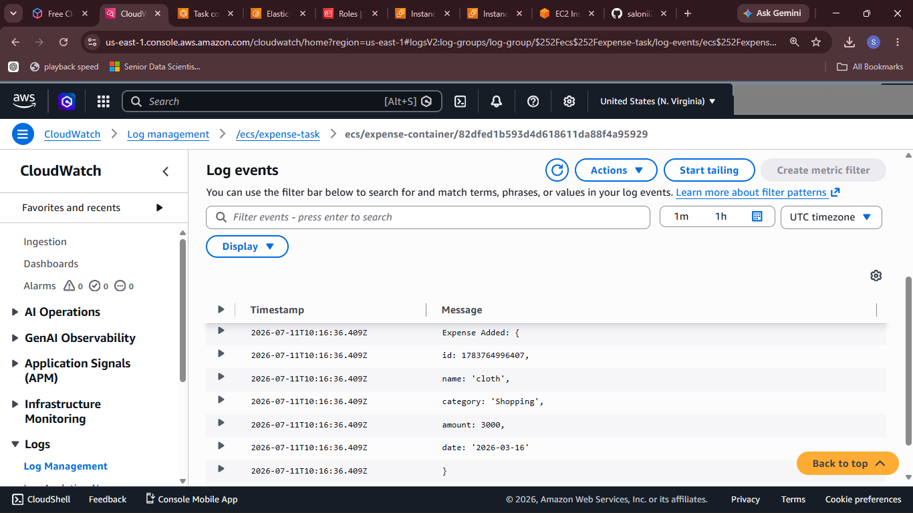
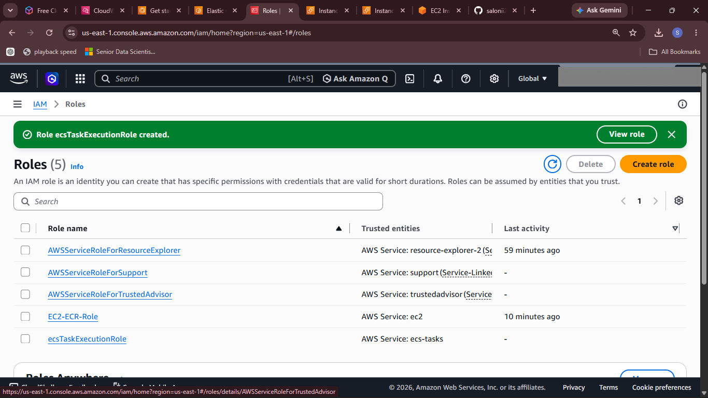

# ☁️ Cloud Expense Tracker


A cloud-native expense tracking application developed using **Node.js** and deployed on **Amazon Web Services (AWS)** using **Docker**, **Amazon Elastic Container Registry (ECR)**, and **Amazon Elastic Container Service (ECS Fargate)**.

This project demonstrates containerization, cloud deployment, monitoring, and DevOps fundamentals.

---

# 🚀 Features

- Add Expense
- Delete Expense
- Expense Categories
- Total Expense Calculation
- Total Records Counter
- Responsive User Interface
- Cloud Deployment on AWS
- Docker Containerization
- CloudWatch Log Monitoring

---

# 🛠 Technology Stack

### Frontend

- HTML5
- CSS3
- JavaScript

### Backend

- Node.js
- Express.js

### Cloud & DevOps

- AWS EC2
- Amazon ECR
- Amazon ECS (Fargate)
- Docker
- IAM
- CloudWatch
- Git
- GitHub

---

# 📁 Project Structure

```
Cloud-Expense-Tracker/

│

├── public/

│ ├── index.html

│ ├── style.css

│ └── script.js

│

├── server.js

├── package.json

├── Dockerfile

├── README.md

└── screenshots/
```

---

# ☁ AWS Architecture

```
Developer

↓

GitHub Repository

↓

Docker Build

↓

Amazon ECR

↓

Amazon ECS (Fargate)

↓

Container Running

↓

CloudWatch Logs

↓

Web Application
```

---

# 🔄 Deployment Workflow

1. Developed application using Node.js

2. Created Docker image

3. Pushed Docker image to Amazon ECR

4. Created ECS Cluster

5. Created Task Definition

6. Launched ECS Task using Fargate

7. Configured IAM Roles

8. Verified logs in CloudWatch

9. Accessed deployed application

---

# 📸 Screenshots

## Home Page


---

## Expense Dashboard


---

## Docker Container Running


---

## Amazon EC2 Instance


---

## Amazon Elastic Container Registry (ECR)


---

## Amazon ECS Cluster


---

## CloudWatch Logs



---

## IAM Roles



---

# 💻 Installation

Clone repository

```bash
git clone https://github.com/YourUsername/Cloud-Expense-Tracker.git
```

Go to project folder

```bash
cd Cloud-Expense-Tracker
```

Install dependencies

```bash
npm install
```

Run application

```bash
node server.js
```

Application runs on

```
http://localhost:8000
```

---

# 🐳 Docker

Build Docker Image

```bash
docker build -t expense-tracker .
```

Run Container

```bash
docker run -d -p 8000:8000 expense-tracker
```

---

# ☁ AWS Services Used

- Amazon EC2
- Amazon ECS (Fargate)
- Amazon ECR
- IAM
- CloudWatch
- Docker

---

# 📚 Learning Outcomes

Through this project I learned:

- Docker Containerization
- Cloud Deployment
- Amazon ECS
- Amazon ECR
- IAM Role Management
- CloudWatch Monitoring
- Node.js Backend Deployment
- GitHub Version Control

---

# 📌 Future Improvements

- User Authentication
- Database Integration (MongoDB)
- Expense Charts
- Monthly Reports
- AWS RDS Integration
- CI/CD Pipeline using GitHub Actions

---

# 👩‍💻 Author

## Saloni Bhosale

Computer Engineering Student

### 📧 Connect with Me

- 💼 LinkedIn: https://www.linkedin.com/in/saloni-bhosale-039642346
- 💻 GitHub: https://github.com/salonii2002

### 📂 Project Repository

https://github.com/salonii2002/cloud-expense-tracker

---

⭐ If you found this project useful, please consider giving it a Star!
